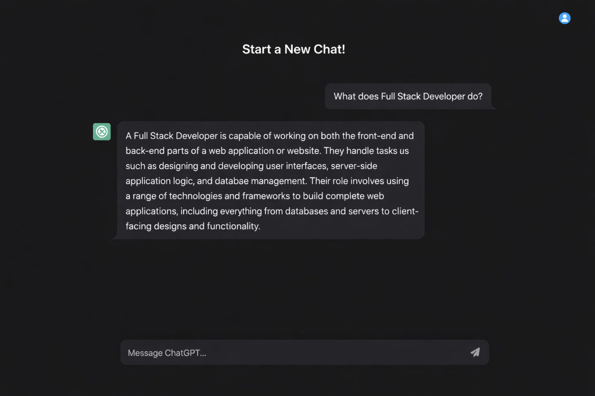
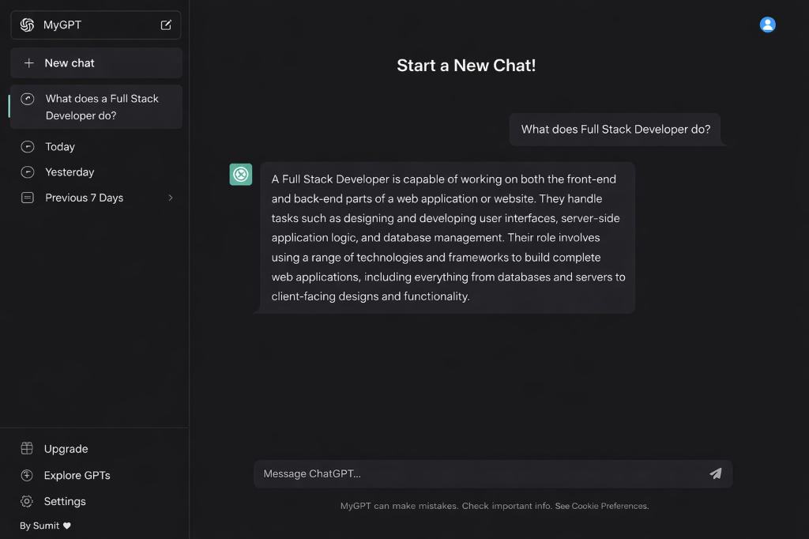

# ChatGPT Clone

A full-stack ChatGPT clone built with React, Node.js, Express, and MongoDB.

## Features
- Real-time chat interface
- Persistent chat history
- Modern UI/UX

## Screenshots



## Installation

### Backend
1. Navigate to the `Backend` folder.
2. Install dependencies:
   ```bash
   npm install
   ```
3. Create a `.env` file in the `Backend` directory with the following variables:
   ```env
   OPENAI_API_KEY=your_api_key_here
   MONGODB_URI=your_mongodb_uri
   ```
4. Start the server:
   ```bash
   npm start
   ```

### Frontend
1. Navigate to the `Frontend` folder.
2. Install dependencies:
   ```bash
   npm install
   ```
3. Start the development server:
   ```bash
   npm run dev
   ```

## ⚠️ Important Note on API Key
The OpenAI API key used in this project is for demonstration purposes. **It may stop working or reach its usage limit due to pricing/quota restrictions.** 

Please generate your own API key from [OpenAI Platform](https://platform.openai.com/) and update the `.env` file to ensure the application continues to function correctly.
